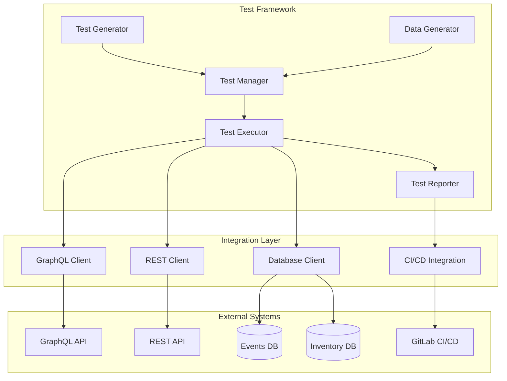
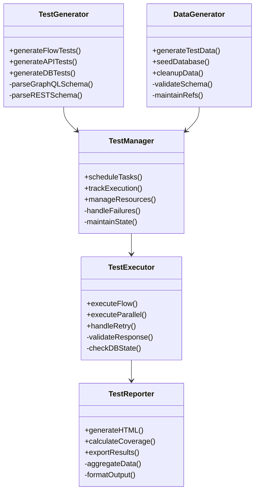
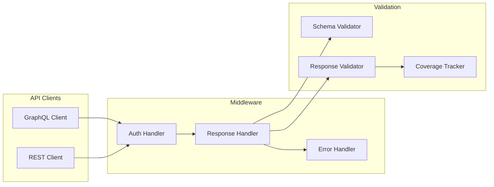

# Test Automation Framework

A comprehensive, enterprise-grade test automation framework designed for scalable API and database testing with advanced reporting capabilities.

## Overview

The Test Automation Framework is a robust solution that provides automated testing capabilities through a modular architecture consisting of the following core components:

- **Test Generator**: Generates test cases for APIs and databases
- **Test Executor**: Executes test flows with parallel processing and retry mechanisms
- **Test Manager**: Manages test resources and execution state
- **Test Reporter**: Generates detailed HTML reports and coverage metrics
- **Data Generator**: Handles test data generation and database seeding



## Installation

1. Clone the repository:
```bash
git clone https://github.com/your-org/test-automation-framework.git
cd test-automation-framework
```

2. Install dependencies:
```bash
cd src/backend
npm install
```

3. Configure environment variables:
```bash
cp .env.example .env
# Edit .env with your configuration
```

4. Build the project:
```bash
npm run build
```

## Configuration

### API Configuration

The framework supports both GraphQL and REST API testing with the following configuration options:

```typescript
// config/api.config.ts
export const apiConfig = {
  graphql: {
    endpoint: process.env.GRAPHQL_ENDPOINT,
    headers: {
      authorization: process.env.GRAPHQL_AUTH_TOKEN
    },
    timeout: 30000,
    retryAttempts: 3
  },
  rest: {
    baseUrl: process.env.REST_BASE_URL,
    headers: {
      authorization: process.env.REST_AUTH_TOKEN
    },
    timeout: 30000,
    retryConfig: {
      attempts: 3,
      backoff: true
    }
  }
}
```

### Logging Configuration

Comprehensive logging is configured with multiple transports:

```typescript
// config/logger.config.ts
export const loggerConfig = {
  level: process.env.LOG_LEVEL || 'info',
  transports: [
    new winston.transports.Console(),
    new winston.transports.File({
      filename: 'logs/error.log',
      level: 'error'
    }),
    new winston.transports.File({
      filename: 'logs/combined.log'
    })
  ]
}
```

## Usage

### Starting the Framework

```typescript
import { initializeSystem } from './src/index';

// Initialize all components
await initializeSystem();
```

### Creating Test Flows

1. Define your test flow in JSON format:
```json
{
  "name": "Sample API Test Flow",
  "steps": [
    {
      "type": "api",
      "method": "POST",
      "endpoint": "/api/data",
      "data": {
        "key": "value"
      },
      "validation": {
        "status": 200,
        "schema": "response.schema.json"
      }
    }
  ]
}
```

2. Execute the test flow:
```typescript
import { TestExecutor } from './core/TestExecutor';

const executor = new TestExecutor();
const results = await executor.executeFlow(testFlow);
```

## Architecture

### Core Components



### Integration Layer



## Security

The framework implements several security measures:

- Authentication and authorization middleware
- Rate limiting
- CORS configuration
- Helmet security headers
- Request validation
- Secure logging practices

```typescript
// Security middleware configuration
app.use(cors({
  origin: process.env.ALLOWED_ORIGINS?.split(','),
  methods: ['GET', 'POST', 'PUT', 'DELETE'],
  credentials: true
}));

app.use(helmet());

const limiter = rateLimit({
  windowMs: 15 * 60 * 1000,
  max: 100
});
app.use(limiter);
```

## Contributing

1. Fork the repository
2. Create a feature branch: `git checkout -b feature/new-feature`
3. Commit changes: `git commit -am 'Add new feature'`
4. Push to branch: `git push origin feature/new-feature`
5. Submit a Pull Request

Please ensure your code:
- Follows the existing code style
- Includes appropriate tests
- Updates documentation as needed
- Passes all CI checks

## License

This project is licensed under the MIT License - see the [LICENSE](LICENSE) file for details.